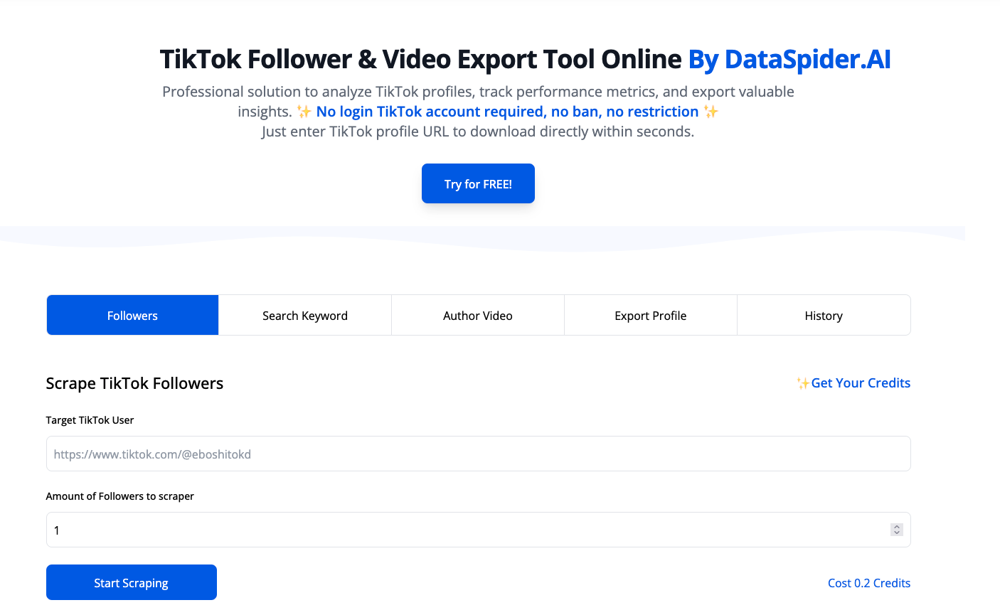

<div align="center">

  <h1>📊 TikTok Data Exporter</h1>
  <p>
    <em>Professional TikTok Data Export & Analytics Tool</em><br>
    <em>专业的TikTok数据导出和分析工具</em>
  </p>
  <p>
    <strong>Visit us: <a href="https://www.dataspider.ai/template/theme/tiktok">www.dataspider.ai/template/theme/tiktok</a></strong>
  </p>
  <div>
    <a href="#"></a>
    <a href="#"></a>
    <a href="#"></a>
  </div>
  
  [English](#english) | [中文](#chinese)
</div>

<div style="text-align: center;">
  <a href="https://www.dataspider.ai/template/theme/tiktok">
    
  </a>
  <p><em>Visit our website for more details: <a href="https://www.dataspider.ai/template/theme/tiktok">www.dataspider.ai/template/theme/tiktok</a></em></p>
</div>

<div id="english">

## About DataSpider.ai
DataSpider.ai provides professional social media data solutions, helping businesses and individuals collect, analyze, and utilize social media data effectively. Our TikTok Data Export Tool is designed to be user-friendly, secure, and efficient, supporting various data export needs.

## The Advantages of Using TikTok Export Tool
Export TikTok followers data with email or get comprehensive profile data from any TikTok user with our powerful export tool.

### TikTok Profile Export
Download 20+ Profile Details From One User
Download comprehensive information from any TikTok user within seconds, including biography, email, phone, business details, engagement metrics, and more than 20 detailed data points. Perfect for thorough audience analysis!

## 🌟 Core Features
- 🛡️ **No Login Required** - Operate without TikTok account credentials
- 📥 **Bulk Export** - Export up to 100,000 records per request
- 🕒 **Real-time Analytics** - Get latest engagement metrics
- 🌐 **Multi-language Support** - EN/CN outputs available
- 🔒 **Zero Ban Risk** - Advanced anti-detection mechanisms

```bash
# Quick Start
1. Input TikTok profile URL
2. Set export parameters
3. Start scraping
4. Download CSV/JSON
```

## 📋 Supported Data Fields
### Followers: TikTok Author Followers Scraper
Get TikTok Followers URL, dates, etc., from TikTok by URLs.

| Field         | Description          | Sample       |
|---------------|----------------------|--------------|
| url           | TikTok Profile URL   | https://tiktok.com/@example |
| uniqueId      | Unique User ID       | @tiktokstar  |
| nickname      | Nickname             | TikTok Star  |
| profile link  | Profile Link         | [Profile](https://tiktok.com/@example) |
| verified      | Verified Status      | True         |
| ttSeller      | TikTok Seller Status | False        |
| signature     | User Signature       | "Hello World" |
| avatar        | Avatar Link          | [Avatar](https://example.com/avatar.jpg) |
| diggCount     | Total Likes          | 12345        |
| followerCount | Follower Count       | 1,234,567    |
| followingCount| Following Count      | 567          |
| heartCount    | Total Hearts         | 123,456      |
| videoCount    | Total Videos         | 589          |

### Search Keyword: TikTok Keyword Search Video
Get TikToker Video Data, Keyword By TikTok.

| Field         | Description          | Sample       |
|---------------|----------------------|--------------|
| VideoID       | Video ID             | 1234567890   |
| cover         | Video Cover          | [Cover](https://example.com/cover.jpg) |
| detailUrl     | Video Detail Link    | [Detail](https://tiktok.com/@example/video/123456) |
| desc          | Video Description    | "Amazing Video" |
| hashtag       | Hashtag              | #funny       |
| collectCount  | Collection Count     | 1234         |
| commentCount  | Comment Count        | 567          |
| diggCount     | Like Count           | 12345        |
| playCount     | Play Count           | 123456       |
| shareCount    | Share Count          | 789          |
| createTime    | Creation Time        | 2025-02-08   |
| duration      | Video Duration (s)   | 60           |
| musicUrl      | Music Link           | [Music](https://example.com/music.mp3) |
| videoUrl      | Video Link           | [Video](https://example.com/video.mp4) |
| imageUrl      | Image Link           | [Image](https://example.com/image.jpg) |
| poiAddress    | Location Address     | "New York"   |
| authorName    | Author Name          | TikTok Star  |
| authorUniqueId| Author Unique ID     | @tiktokstar  |
| authorAvatarThumb | Author Avatar    | [Avatar](https://example.com/avatar.jpg) |
| authorDiggCount | Author Likes       | 12345        |
| authorFollowerCount | Author Followers | 56789      |
| authorFollowingCount | Author Following | 678      |
| authorHeartCount | Author Hearts     | 123456       |
| authorVideoCount | Author Videos     | 78           |
| authorFriendCount | Author Friends   | 567          |
| authorVerified | Author Verified     | True         |

### Author Video: TikTok Creator Videos Collector
Use the TikTok Creator Videos Collector to retrieve video authors, URLs, dates, and more from TikTok via provided URLs.

| Field         | Description          | Sample       |
|---------------|----------------------|--------------|
| VideoID       | Video ID             | 1234567890   |
| cover         | Video Cover          | [Cover](https://example.com/cover.jpg) |
| detailUrl     | Video Detail Link    | [Detail](https://tiktok.com/@example/video/123456) |
| desc          | Video Description    | "Amazing Video" |
| hashtag       | Hashtag              | #funny       |
| collectCount  | Collection Count     | 1234         |
| commentCount  | Comment Count        | 567          |
| diggCount     | Like Count           | 12345        |
| playCount     | Play Count           | 123456       |
| shareCount    | Share Count          | 789          |
| createTime    | Creation Time        | 2025-02-08   |
| duration      | Video Duration (s)   | 60           |
| musicUrl      | Music Link           | [Music](https://example.com/music.mp3) |
| videoUrl      | Video Link           | [Video](https://example.com/video.mp4) |
| imageUrl      | Image Link           | [Image](https://example.com/image.jpg) |
| poiAddress    | Location Address     | "New York"   |
| authorName    | Author Name          | TikTok Star  |
| authorUniqueId| Author Unique ID     | @tiktokstar  |
| authorAvatarThumb | Author Avatar    | [Avatar](https://example.com/avatar.jpg) |
| authorDiggCount | Author Likes       | 12345        |
| authorFollowerCount | Author Followers | 56789      |
| authorFollowingCount | Author Following | 678      |
| authorHeartCount | Author Hearts     | 123456       |
| authorVideoCount | Author Videos     | 78           |
| authorFriendCount | Author Friends   | 567          |
| authorVerified | Author Verified     | True         |

### Export Profile: TikTok Author Profile Scraper
Get TikToker Author Profile, URL, dates, etc., from TikTok by URLs.

| Field         | Description          | Sample       |
|---------------|----------------------|--------------|
| uniqueId      | Unique User ID       | @example     |
| nickname      | Nickname             | Example User |
| ttSeller      | TikTok Seller Status | False        |
| signature     | User Signature       | "Data Exporter" |
| secUid        | Secure User ID       | SEC123456    |
| verified      | Verified Status      | True         |
| link          | Profile Link         | [Link](https://tiktok.com/@example) |
| avatarThumb   | Avatar Thumbnail     | [Avatar](https://example.com/avatar.jpg) |
| videoCount    | Total Videos         | 123          |
| heartCount    | Total Hearts         | 456789       |
| friendCount   | Friend Count         | 678          |
| followingCount| Following Count      | 789          |
| followerCount | Follower Count       | 1,234,567    |

## Frequently Asked Questions

Can't find the answer you're looking for? Reach out to our customer support team.

### Does it use my TikTok account to scrape?
No! Our scraper online service doesn't require you to log in to your TikTok account. It works independently of user accounts, ensuring your privacy and security.

### Is TikTok data export tool 100% safe?
Yes. It's completely safe to use as you don't need to login to your TikTok account or install any application. We don't access or store any cookies from your browser, ensuring maximum security for your data.

### How long does it take to export TikTok data?
Our tool processes hundreds of data points within seconds. For larger datasets (tens of thousands of records), it may take a few minutes. Once completed, the data is automatically exported to a local CSV file for your convenience.

### Can I use the TikTok data export tool for free?
Yes! You'll receive free credits upon registration. For users who need to export larger amounts of data, we offer premium options - please contact us for details.

## Contact Us
Website: [www.dataspider.ai](https://www.dataspider.ai)  
Email: support@dataspider.ai

</div>

<div id="chinese">

## 关于 DataSpider.ai
DataSpider.ai 提供专业的社交媒体数据解决方案，帮助企业和个人有效地收集、分析和利用社交媒体数据。我们的 TikTok 数据导出工具设计简单易用、安全可靠且高效，可满足各种数据导出需求。

## 使用 TikTok 导出工具的优势
通过我们强大的导出工具，导出带有电子邮件的 TikTok 粉丝数据或获取任何 TikTok 用户的完整个人资料数据。

### TikTok 个人资料导出
从单个用户下载 20+ 详细资料
在几秒钟内下载任何 TikTok 用户的完整信息，包括个人简介、电子邮件、电话、商业详情、互动指标等超过 20 个详细数据点。非常适合进行深入的受众分析！

## 🌟 核心功能
- 🛡️ **无需登录** - 无需 TikTok 账号凭证即可操作
- 📥 **批量导出** - 每次请求可导出多达 100,000 条记录
- 🕒 **实时分析** - 获取最新的互动指标
- 🌐 **多语言支持** - 支持中英文输出
- 🔒 **零封禁风险** - 先进的反检测机制

```bash
# 快速开始
1. 输入 TikTok 个人资料 URL
2. 设置导出参数
3. 开始抓取
4. 下载 CSV/JSON
```

## 📋 支持的数据字段
### 粉丝数据：TikTok作者粉丝采集器
通过URL获取TikTok粉丝的URL、日期等信息。

| 字段          | 描述              | 示例数据     |
|---------------|-------------------|--------------|
| url           | TikTok个人主页URL | https://tiktok.com/@example |
| uniqueId      | 用户唯一ID        | @tiktokstar  |
| nickname      | 昵称              | TikTok Star  |
| profile link  | 主页链接          | [个人主页](https://tiktok.com/@example) |
| verified      | 认证状态          | True         |
| ttSeller      | TikTok商家状态    | False        |
| signature     | 个人签名          | "Hello World" |
| avatar        | 头像链接          | [头像](https://example.com/avatar.jpg) |
| diggCount     | 点赞总数          | 12345        |
| followerCount | 粉丝数量          | 1,234,567    |
| followingCount| 关注数量          | 567          |
| heartCount    | 获赞总数          | 123,456      |
| videoCount    | 视频总数          | 589          |

### 关键词搜索：TikTok关键词视频搜索
通过TikTok关键词获取视频数据。

| 字段          | 描述              | 示例数据     |
|---------------|-------------------|--------------|
| VideoID       | 视频ID            | 1234567890   |
| cover         | 视频封面          | [封面](https://example.com/cover.jpg) |
| detailUrl     | 视频详情链接      | [详情](https://tiktok.com/@example/video/123456) |
| desc          | 视频描述          | "精彩视频"    |
| hashtag       | 话题标签          | #搞笑        |
| collectCount  | 收藏数量          | 1234         |
| commentCount  | 评论数量          | 567          |
| diggCount     | 点赞数量          | 12345        |
| playCount     | 播放次数          | 123456       |
| shareCount    | 分享次数          | 789          |
| createTime    | 创建时间          | 2025-02-08   |
| duration      | 视频时长(秒)      | 60           |
| musicUrl      | 音乐链接          | [音乐](https://example.com/music.mp3) |
| videoUrl      | 视频链接          | [视频](https://example.com/video.mp4) |
| imageUrl      | 图片链接          | [图片](https://example.com/image.jpg) |
| poiAddress    | 地理位置          | "纽约"        |
| authorName    | 作者名称          | TikTok Star  |
| authorUniqueId| 作者唯一ID        | @tiktokstar  |
| authorAvatarThumb | 作者头像      | [头像](https://example.com/avatar.jpg) |
| authorDiggCount | 作者获赞数      | 12345        |
| authorFollowerCount | 作者粉丝数  | 56789        |
| authorFollowingCount | 作者关注数 | 678          |
| authorHeartCount | 作者获赞总数   | 123456       |
| authorVideoCount | 作者视频数     | 78           |
| authorFriendCount | 作者好友数    | 567          |
| authorVerified | 作者认证状态     | True         |

### 作者视频：TikTok创作者视频采集器
使用TikTok创作者视频采集器通过提供的URL获取视频作者、URL、日期等信息。

| 字段          | 描述              | 示例数据     |
|---------------|-------------------|--------------|
| VideoID       | 视频ID            | 1234567890   |
| cover         | 视频封面          | [封面](https://example.com/cover.jpg) |
| detailUrl     | 视频详情链接      | [详情](https://tiktok.com/@example/video/123456) |
| desc          | 视频描述          | "精彩视频"    |
| hashtag       | 话题标签          | #搞笑        |
| collectCount  | 收藏数量          | 1234         |
| commentCount  | 评论数量          | 567          |
| diggCount     | 点赞数量          | 12345        |
| playCount     | 播放次数          | 123456       |
| shareCount    | 分享次数          | 789          |
| createTime    | 创建时间          | 2025-02-08   |
| duration      | 视频时长(秒)      | 60           |
| musicUrl      | 音乐链接          | [音乐](https://example.com/music.mp3) |
| videoUrl      | 视频链接          | [视频](https://example.com/video.mp4) |
| imageUrl      | 图片链接          | [图片](https://example.com/image.jpg) |
| poiAddress    | 地理位置          | "纽约"        |
| authorName    | 作者名称          | TikTok Star  |
| authorUniqueId| 作者唯一ID        | @tiktokstar  |
| authorAvatarThumb | 作者头像      | [头像](https://example.com/avatar.jpg) |
| authorDiggCount | 作者获赞数      | 12345        |
| authorFollowerCount | 作者粉丝数  | 56789        |
| authorFollowingCount | 作者关注数 | 678          |
| authorHeartCount | 作者获赞总数   | 123456       |
| authorVideoCount | 作者视频数     | 78           |
| authorFriendCount | 作者好友数    | 567          |
| authorVerified | 作者认证状态     | True         |

### 导出资料：TikTok作者资料采集器
通过URL获取TikTok作者资料、URL、日期等信息。

| 字段          | 描述              | 示例数据     |
|---------------|-------------------|--------------|
| uniqueId      | 用户唯一ID        | @example     |
| nickname      | 昵称              | Example User |
| ttSeller      | TikTok商家状态    | False        |
| signature     | 个人签名          | "数据导出器"  |
| secUid        | 安全用户ID        | SEC123456    |
| verified      | 认证状态          | True         |
| link          | 主页链接          | [链接](https://tiktok.com/@example) |
| avatarThumb   | 头像缩略图        | [头像](https://example.com/avatar.jpg) |
| videoCount    | 视频总数          | 123          |
| heartCount    | 获赞总数          | 456789       |
| friendCount   | 好友数量          | 678          |
| followingCount| 关注数量          | 789          |
| followerCount | 粉丝数量          | 1,234,567    |

## 常见问题

找不到您需要的答案？请联系我们的客户支持团队。

### 是否需要使用我的 TikTok 账号进行抓取？
不需要！我们的在线抓取服务无需登录您的 TikTok 账号。它独立于用户账号运行，确保您的隐私和安全。

### TikTok 数据导出工具是否 100% 安全？
是的。使用完全安全，因为您无需登录 TikTok 账号或安装任何应用程序。我们不会访问或存储您浏览器中的任何 cookie，确保您的数据最大程度的安全。

### 导出 TikTok 数据需要多长时间？
我们的工具可以在几秒钟内处理数百个数据点。对于较大的数据集（数万条记录），可能需要几分钟。完成后，数据会自动导出为本地 CSV 文件，方便您使用。

### 我可以免费使用 TikTok 数据导出工具吗？
是的！注册后您将获得免费额度。对于需要导出大量数据的用户，我们提供高级选项 - 详情请联系我们。

## 联系我们
网站：[www.dataspider.ai](https://www.dataspider.ai)  
邮箱：support@dataspider.ai

</div>
